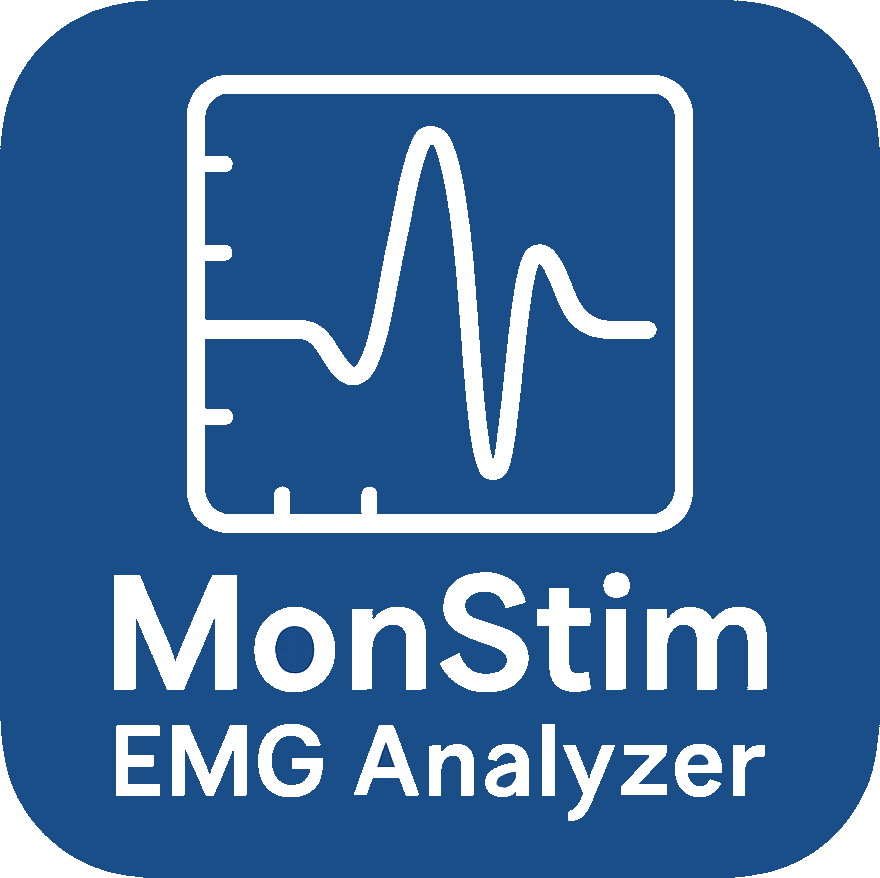

# MonStim Analyzer

<strong>Reproducible EMG curation, analysis, visualization, and export for MonStim laboratory exports.</strong>

<a href="https://github.com/AEWorthy/MonStim-Analyzer/releases">Download for Windows</a> · <a href="QUICKSTART.md">Quick start</a> · <a href="https://worthy-lab.org/MonStim-Analyzer/">Documentation</a> · <a href="CITATION.cff">Cite MonStim</a> · <a href="https://worthy-lab.org/">Worthy Lab</a>

> **Current release: v0.7.2 (Windows beta).** Download only from official GitHub Releases. Windows may display a warning because binaries are not code-signed; verify the published SHA-256 checksum before running a release.

MonStim Analyzer is a desktop application for importing, organizing, curating, analyzing, visualizing, and exporting electrophysiology data recorded by the MonStim V3 LabVIEW acquisition program. It provides a traceable path from a recording hierarchy to plots and tabular results. Use it as an all-in-one curation-to-plotting-and-export suite, or use it to structure and curate data before sending exports to your own analysis pipeline.

## What MonStim does

- Imports MonStim V3D and V3H CSV exports into an experiment > dataset > session > recording hierarchy.
- Supports raw/filtered trace review, latency-window management, reflex and M-max analysis, recording exclusion, and bulk exports.
- Keeps analysis context visible through profiles, diagnostic notices, and reports.
- Supports structured curation and traceable export when downstream software performs the final custom or statistical analysis.
- Supports official importer add-ons for other streams that can map safely to MonStim’s managed format.

## Is my data supported?

| Source | Status | Next step |
| --- | --- | --- |
| MonStim V3D/V3H CSV exports | Supported | Follow the [Quick Start](QUICKSTART.md). |
| Another acquisition system or custom stream | Not directly supported | Read [Importer add-ons](docs/user/importer_addons.md) or [request an importer](https://github.com/AEWorthy/MonStim-Analyzer/issues/new?template=importer_request.yml). |
| macOS/Linux packaged application | Not currently distributed | Windows is the supported binary platform; source development is documented separately. |

## Start here

1. Download the latest Windows release and extract the whole archive; do not move only the executable.
2. Read the [Quick Start](QUICKSTART.md) and import a MonStim experiment folder.
3. Inspect a raw and filtered session trace before changing windows or interpreting a summary.
4. Keep the profile, latency windows, exclusions, and amplitude method with exported results.

## Documentation

- [Documentation site](https://worthy-lab.org/MonStim-Analyzer/) — searchable user, scientific, and developer documentation.
- [Understanding the data hierarchy](docs/user/data_hierarchy.md) — recordings, sessions, datasets, experiments, and their intended roles.
- [Importing experiments](docs/user/importing_experiments.md) — expected source layout and first checks.
- [Analysis methods](docs/science/analysis_methods.md) — formulas, units, and interpretation limits.
- [Troubleshooting](docs/user/troubleshooting.md) — diagnostic notices and recovery steps.
- [Importer add-ons](docs/user/importer_addons.md) — compatibility, installation, and support boundary.
- [Updating MonStim](docs/user/updates.md) — signed update checks, staging, rollback, and data-safety guarantees.
- [How to cite MonStim](docs/user/citing_monstim.md) — preferred software citation and provenance guidance.
- [Worthy Lab](https://worthy-lab.org/) — Andrew Worthy's CV, research background, and contact information.

## Support and contribution

Use the provided issue forms for bugs, documentation, performance, feature requests, and [importer requests](https://github.com/AEWorthy/MonStim-Analyzer/issues/new?template=importer_request.yml). The importer form is designed for researchers and does not require programming experience. A useful bug report includes the MonStim version, Windows version, active profile, selected level, exact steps, and a redacted error report when appropriate. Do not upload identifiable research data.

See [CONTRIBUTING.md](CONTRIBUTING.md) for source setup and [SECURITY.md](SECURITY.md) for private vulnerability reporting.

## Citation and license

If MonStim contributes to academic work, please cite it using [CITATION.cff](CITATION.cff) or **Help > Copy Citation**. Exports include a machine-readable provenance sidecar to make this information easy to retain.

MonStim Analyzer is licensed under [PolyForm Noncommercial 1.0.0](LICENSE). Commercial use requires prior permission; see [NOTICE](NOTICE) and the [license overview](docs/licensing.md).
