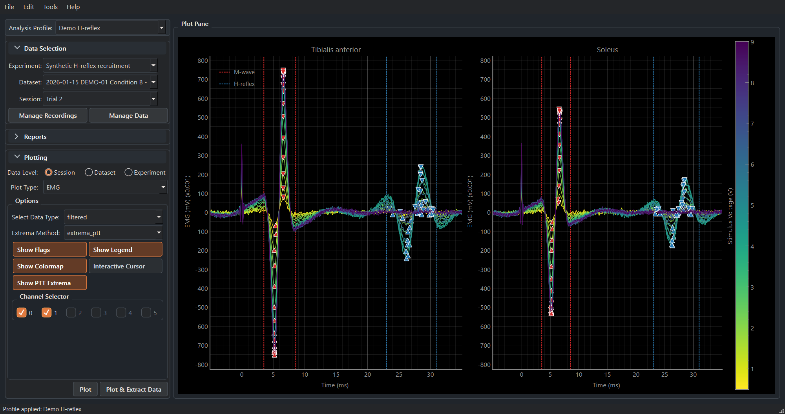
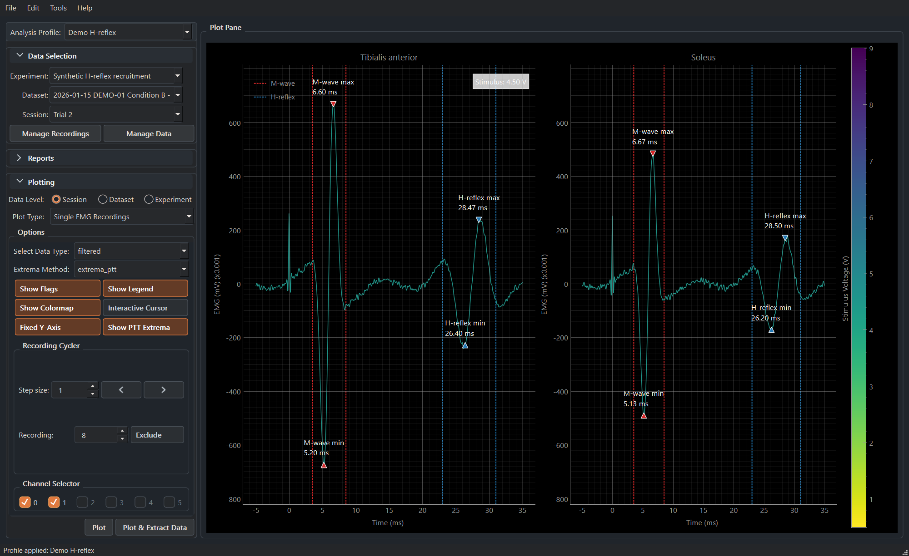
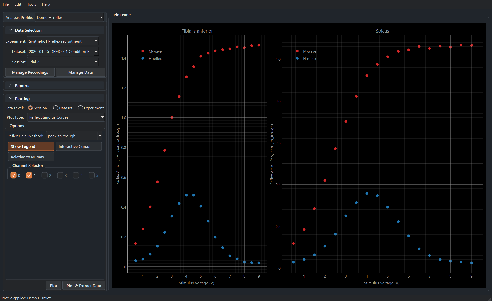
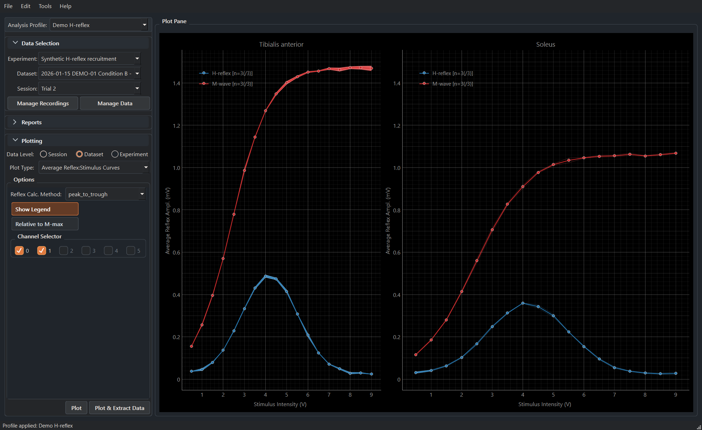
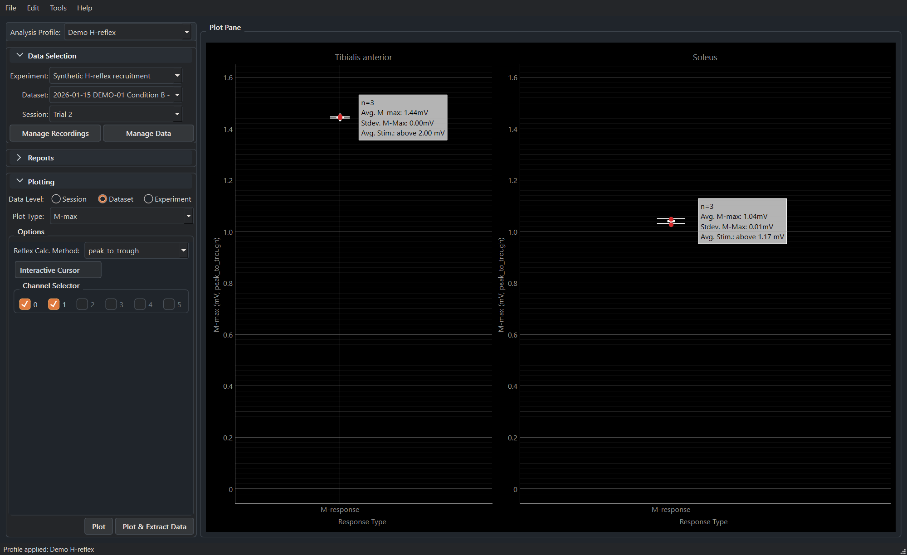
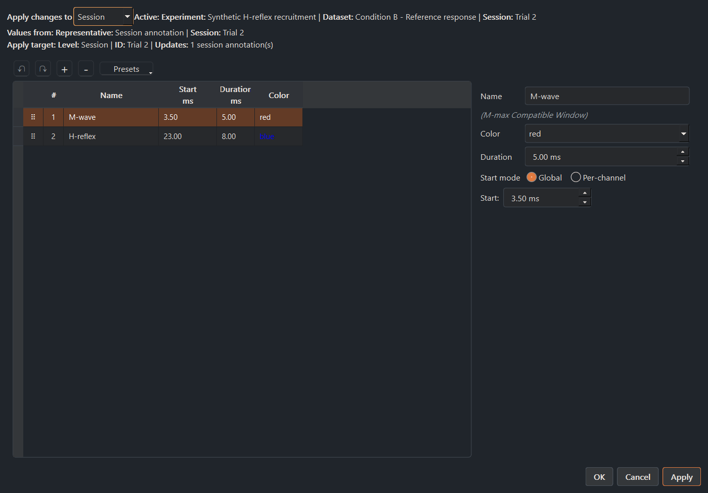
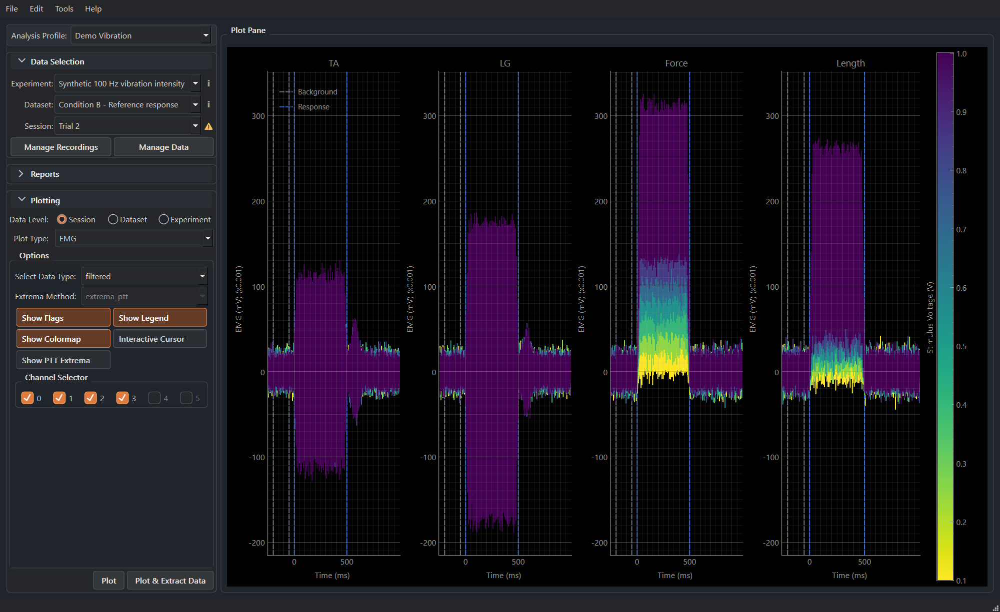
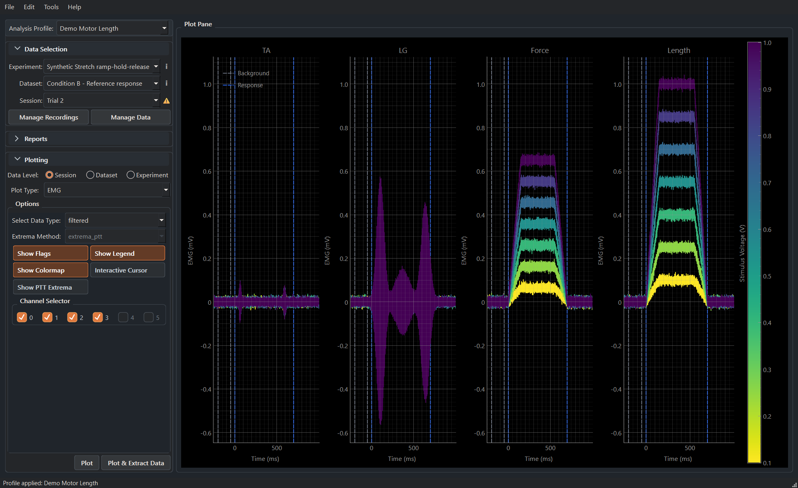

# MonStim Analyzer

**Reproducible EMG curation, analysis, visualization, and export for MonStim laboratory exports.**

MonStim Analyzer helps researchers import MonStim V3 recordings, organize and curate data, define latency windows, calculate EMG responses, visualize results, and export traceable outputs. Use it as an all-in-one curation-to-plotting-and-export suite, or use its managed hierarchy and review tools to prepare data for your own downstream analysis pipeline.

[:octicons-download-16: Download Windows beta](https://github.com/AEWorthy/MonStim-Analyzer/releases){ .md-button .md-button--primary }
[:octicons-rocket-16: Start your first analysis](https://worthy-lab.org/MonStim-Analyzer/user/getting_started.html){ .md-button }

## Project and developer

MonStim Analyzer is developed by [Andrew Worthy](https://worthy-lab.org/). Visit the [Worthy Lab website](https://worthy-lab.org/) for his CV, research background, and contact information.

## Before you import

MonStim directly supports CSV exports from the MonStim V3D and V3H LabVIEW acquisition formats. It does not infer arbitrary proprietary or custom acquisition layouts. If your data come from another system, use an approved importer add-on or [request an importer](https://github.com/AEWorthy/MonStim-Analyzer/issues/new?template=importer_request.yml).

## A typical workflow

1. Import an experiment and inspect a raw and filtered traces.
2. Confirm channel identity, timing, stimulus alignment, and latency windows.
3. Select the analysis profile and amplitude method appropriate for the protocol.
4. Review diagnostic notices, exclusions, plot contribution counts, and missing values.
5. Interpret results in MonStim, or export curated data with the analysis settings needed for your downstream pipeline.

## Explore the synthetic demo protocols

The packaged synthetic-protocol demo archive lets new users explore H-reflex recruitment, 100 Hz vibration, and stretch ramp-hold-release analysis before importing their own recordings. Every screen below is captured from MonStim's real UI using fictional data only.

<section class="demo-carousel" data-demo-carousel aria-label="MonStim Analyzer demo screens">
  

    <figure class="demo-carousel__slide">
      
      <figcaption><strong>Inspect EMG overlays.</strong> Review aligned TA and LG traces with response windows before summarizing a session.</figcaption>
    </figure>
    <figure class="demo-carousel__slide">
      
      <figcaption><strong>Review individual recordings.</strong> Step through a stimulus series and inspect one response at a time.</figcaption>
    </figure>
    <figure class="demo-carousel__slide">
      
      <figcaption><strong>Map within-session recruitment.</strong> Compare response amplitudes across stimulus intensity.</figcaption>
    </figure>
    <figure class="demo-carousel__slide">
      
      <figcaption><strong>Summarize recruitment across sessions.</strong> View dataset-level M-wave and H-reflex trends.</figcaption>
    </figure>
    <figure class="demo-carousel__slide">
      
      <figcaption><strong>Audit M-max calculations.</strong> Inspect how the plateau-detection algorithm performs in the M-max calculation and the normalization process at the dataset level.</figcaption>
    </figure>
    <figure class="demo-carousel__slide">
      
      <figcaption><strong>Set timing windows deliberately.</strong> Create, edit, and review response latency windows in the application. Set custom timing parameters for each channel.</figcaption>
    </figure>
    <figure class="demo-carousel__slide">
      
      <figcaption><strong>100 Hz vibration demo.</strong> Visualize, curate, and analyze the effects of muscle vibration stimuli on LG and TA muscle activity.</figcaption>
    </figure>
    <figure class="demo-carousel__slide">
      
      <figcaption><strong>Ramp-hold-release stretch demo.</strong> Visualize, curate, and analyze the effects of muscle stretch stimuli on LG and TA muscle activity.</figcaption>
    </figure>
    

      <button class="demo-carousel__button demo-carousel__button--previous" type="button" data-demo-carousel-previous aria-label="Previous demo screen">&#8249;</button>
      

      <button class="demo-carousel__button demo-carousel__button--next" type="button" data-demo-carousel-next aria-label="Next demo screen">&#8250;</button>
    

    

      

      Auto-advancing every 7 seconds.
    

  

</section>

## Documentation by need

- New to MonStim: [Getting started](https://worthy-lab.org/MonStim-Analyzer/user/getting_started.html), [Understanding the data hierarchy](user/data_hierarchy.md), and [Importing experiments](user/importing_experiments.md).
- Looking for the main application reference: [Using MonStim Analyzer](user/using_monstim.md).
- Running analyses: [Analysis profiles](user/analysis_profiles.md), [Latency windows](user/latency_windows.md), and [Exporting results](user/exporting_results.md).
- Understanding a method: [Analysis methods](science/analysis_methods.md), [EMG processing](science/emg_processing.md), and [M-max estimation](science/mmax_estimation.md).
- Getting help: [Troubleshooting](user/troubleshooting.md), the in-app error-report tool, or an issue form.

## Citation

If MonStim contributes to academic work, please cite the software. The repository provides a machine-readable `CITATION.cff`, and the application offers **Help > Copy Citation**. See [How to cite MonStim](user/citing_monstim.md).
