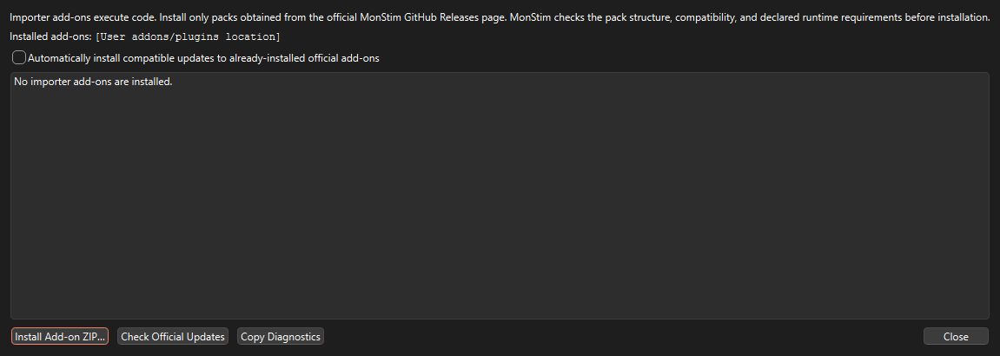
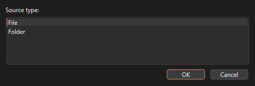

# Importer add-ons

## Purpose and trust boundary

MonStim directly supports MonStim V3D/V3H CSV exports. Other acquisition systems often encode sampling, channels, stimulus metadata, and recording hierarchy differently; treating them as MonStim files would risk incorrect analysis. An importer add-on maps a reviewed foreign format to MonStim’s managed format.

Importer add-ons contain executable Python code. Install only packs obtained from the official MonStim GitHub Releases page.

## Install an official pack

1. Open **Help > Manage Importer Add-ons…**.
2. Download the pack ZIP from the official release and compare its SHA-256 checksum with the release note.
3. Choose **Install Add-on ZIP…**, select the ZIP, and confirm that you trust the source.
4. MonStim checks the archive, manifest, application/plugin compatibility, and required bundled capabilities before installation.
5. Choose **File > Import using Add-on…**, select a source file or folder, and let MonStim detect the compatible importer. It asks you to choose only when multiple importers recognize the source.

MonStim checks the signed official catalog at most once per day without delaying startup. By default it only notifies you about updates; you can opt in to automatic installation of compatible updates for official add-ons you already installed.

Packs live in your per-user MonStim application-data folder, not in the application installation directory. The Add-on Manager displays the exact location and can copy a diagnostic report for support.

## Compatibility and dependency help

The manager rejects an incompatible pack before activation. It explains whether you need a newer MonStim release, a compatible pack version, an approved offline ZIP, or support. Do **not** attempt to install Python packages into the Windows application: a PyInstaller release is a bundled runtime, not a user-managed Python environment.

Official add-ons may use only the documented MonStim plugin API and dependencies packaged with MonStim, unless an approved pure-Python dependency is included in the pack. Native dependencies require a pack built for the exact MonStim Windows release.

## How imported data stay safe

Add-ons return normalized recordings to MonStim rather than writing directly into an experiment folder. MonStim validates sampling, channels, identifiers, metadata, and the managed-store files in a unique staging directory. Only a fully valid import is atomically activated; canceled or failed imports remove only staging output and never overwrite an existing experiment or mutate raw source files.

Importer API 2.x uses this normalized contract. Older direct-write add-ons are intentionally incompatible and should be rebuilt against the current template before installation.

## Request an importer

Open a feature request and provide, when permitted:

- acquisition system/software and version;
- representative de-identified source files and folder layout;
- channel mapping, sampling rate, units, and stimulus metadata;
- desired experiment/dataset/session grouping;
- a description of the analysis workflow the importer must support.

Do not attach identifiable or restricted research data to a public issue. Contact the maintainer for a private transfer route when needed.
