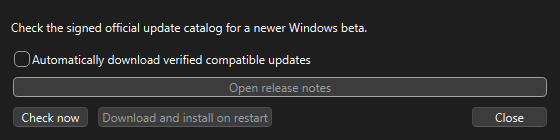

# Updating MonStim safely

MonStim checks the signed official Windows-beta update catalog at most once per day. It does not delay startup and is safe when offline.

Choose **Help > Check for Updates…** to check immediately. You may opt in to automatic download of compatible verified releases; installation and restart always require your explicit approval. Before any download, MonStim verifies the catalog signature; before staging a release, it verifies the SHA-256 checksum and the package manifest.

Updates are staged beside the current application in a per-user version cache. Research experiments, exports, settings, profiles, and importer add-ons are not stored there and are never replaced by the updater. The prior application version remains available for rollback.

Automatic installation is available only for a packaged release containing the MonStim update helper. Portable copies outside the managed update layout can still download and verify a release, but may require manual extraction.

Windows binaries are not code-signed. Install only updates discovered through MonStim's signed official catalog or downloaded from the official GitHub Releases page.
